  # ShopSphere – E-Commerce Order Analytics


ShopSphere is a Big Data Analytics project for analyzing e-commerce order and customer data using Hadoop MapReduce. The project demonstrates distributed data storage using HDFS, distributed processing using MapReduce and job management using YARN.

---

# 1. Project Overview

The ShopSphere dataset contains information about customer profiles and their online orders.

The project uses two main datasets:

### `orders.csv`

| Attribute    | Description                                     |
| ------------ | ----------------------------------------------- |
| `orderId`    | Unique identifier of an order                   |
| `customerId` | Identifier of the customer who placed the order |
| `category`   | Product category                                |
| `quantity`   | Number of items ordered                         |
| `price`      | Price per item                                  |
| `orderDate`  | Date on which the order was placed              |

### `customers.csv`

| Attribute        | Description                |
| ---------------- | -------------------------- |
| `customerId`     | Unique customer identifier |
| `city`           | Customer's city            |
| `membershipTier` | Customer membership level  |

The project implements five business problems using Hadoop MapReduce.

---

# 2. Objectives

The main objectives of the project are:

* Store and process e-commerce data using HDFS.
* Implement business analytics using Hadoop MapReduce.
* Perform aggregation and join operations on large datasets.
* Analyze revenue, customers, cities and membership tiers.
* Execute MapReduce jobs using YARN.
* Obtain and analyze results from HDFS.
* Compare different Big Data processing approaches through Hive and Pig.

---

# 3. Technologies Used

* **Java** – MapReduce implementation
* **Hadoop** – Distributed data processing framework
* **HDFS** – Distributed file storage
* **MapReduce** – Distributed computation
* **YARN** – Resource and job management
* **Docker** – Containerized Hadoop environment
* **Hive** – SQL-based Big Data processing
* **Pig** – Data-flow based Big Data processing
* **GitHub** – Source code and project management

---

# 4. Hadoop Environment

The Hadoop cluster was deployed using Docker.

The cluster consists of the following services:

| Component       | Role                                       |
| --------------- | ------------------------------------------ |
| NameNode        | Manages HDFS metadata and namespace        |
| DataNode        | Stores HDFS data blocks                    |
| ResourceManager | Manages YARN resources and applications    |
| NodeManager     | Executes and manages tasks on worker nodes |

The Hadoop image used for the project is:

```text
apache/hadoop:3.4.3
```

The project uses HDFS for storing the input datasets and output generated by MapReduce jobs.

---

# 5. Dataset

The project uses:

```text
orders.csv
customers.csv
```

The generated dataset contains:

* 100 customers
* 1000 orders
* 10 cities
* 3 membership tiers
* Multiple product categories

The customer cities include:

```text
Ahmedabad
Bangalore
Chennai
Delhi
Hyderabad
Jaipur
Kolkata
Lucknow
Mumbai
Pune
```

Membership tiers include:

```text
Silver
Gold
Platinum
```

---

# 6. HDFS Data Ingestion

The datasets were uploaded to HDFS under:

```text
/shopsphere/input/
```

The HDFS directory contains:

```text
/shopsphere/input/orders.csv
/shopsphere/input/customers.csv
```

The input files were verified using:

```bash
hdfs dfs -ls /shopsphere/input
```

### Screenshot – HDFS Input Files

> Insert screenshot of:
>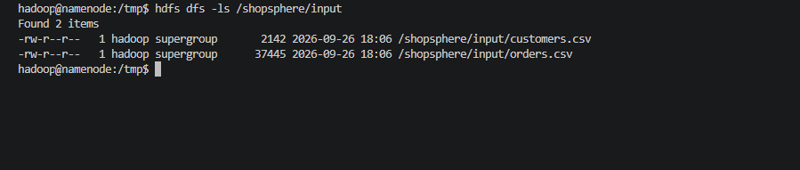

---

# 7. Problem 1 – Category-wise Revenue and Order Count

## Objective

Calculate the revenue generated by each product category and determine the number of orders associated with each category.

## Formula

```text
Revenue = Quantity × Price
```

For every order, the mapper calculates the order revenue and emits the category as the key.

Conceptually:

```text
Category → Revenue
```

The reducer groups all records belonging to the same category and calculates:

* Total revenue
* Order count

## MapReduce Flow

```text
orders.csv
     |
     v
   Mapper
     |
     | category → revenue
     v
 Shuffle and Sort
     |
     v
  Reducer
     |
     v
Category-wise revenue
and order count
```

## Implementation

Files:

```text
src/Problem1/
├── Problem1Mapper.java
├── Problem1Reducer.java
└── Problem1Driver.java
```

## Execution

The Java files are compiled using the Hadoop classpath and packaged into a JAR.

The MapReduce job is submitted to YARN using Hadoop's `hadoop jar` command.

## Output

> Add the actual Problem 1 Hadoop output here after execution.

### Screenshot – Problem 1 Execution

> Insert screenshot showing:
>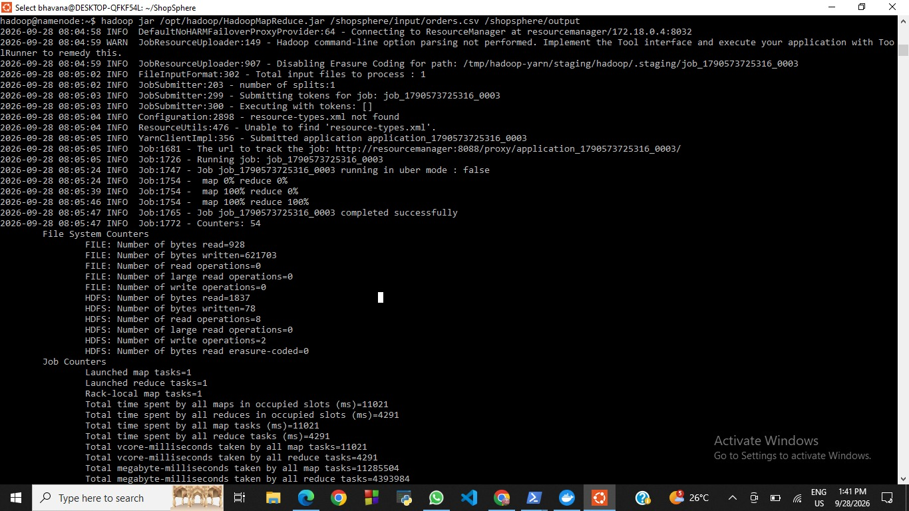
> `map 100%`
>
> `reduce 100%`
>
> `Job ... completed successfully`

### Screenshot – Problem 1 Output

> Insert screenshot showing the HDFS output using:
>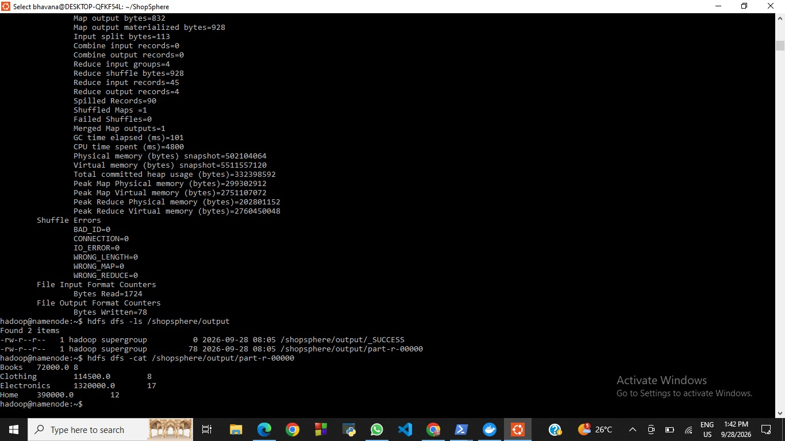
> `hdfs dfs -cat <P1-output-path>`

---

# 8. Problem 2 – City-wise Revenue Analysis

## Objective

Calculate the total revenue generated by each city by associating orders with customer profiles.

## Formula

```text
Revenue = Quantity × Price
```

The `customerId` is used to identify the city associated with each order.

## MapReduce Approach

The mapper reads the order data and uses the customer information to determine the city associated with each customer.

The mapper emits:

```text
City → Revenue
```

The reducer groups all revenue values belonging to the same city and calculates the total revenue.

## MapReduce Flow

```text
orders.csv
     |
     v
   Mapper
     |
     | customerId → city
     | city → revenue
     v
 Shuffle and Sort
     |
     v
  Reducer
     |
     v
Total revenue
for each city
```

## Implementation

Files:

```text
src/Problem2/
├── Problem2Mapper.java
├── Problem2Reducer.java
└── Problem2Driver.java
```

## Execution

The P2 JAR was successfully created and executed on the Dockerized Hadoop cluster.

The MapReduce job was submitted using:

```bash
hadoop jar /tmp/shopsphere-p2.jar \
Problem2.Problem2Driver \
/shopsphere/input/orders.csv \
/shopsphere/input/customers.csv \
/shopsphere/output/p2
```

## Execution Result

The job completed successfully.

```text
map 100% reduce 100%
Job job_1790503950384_0001 completed successfully
```

### Hadoop Counters

```text
Map input records       = 1001
Map output records      = 1000
Reduce input groups     = 10
Reduce input records    = 1000
Reduce output records   = 10
Failed shuffles         = 0
```

The 1001 input records correspond to:

```text
1000 order records + 1 CSV header
```

The reducer produced 10 output groups because the dataset contains 10 cities.

## Final Output

```text
Ahmedabad       673492.00
Bangalore       1990935.00
Chennai         1198286.00
Delhi           890441.00
Hyderabad       973545.00
Jaipur          1766233.00
Kolkata         492562.00
Lucknow         1241822.00
Mumbai          1484424.00
Pune            1529448.00
```

### Result Table

| City      | Total Revenue |
| --------- | ------------: |
| Ahmedabad |   ₹673,492.00 |
| Bangalore | ₹1,990,935.00 |
| Chennai   | ₹1,198,286.00 |
| Delhi     |   ₹890,441.00 |
| Hyderabad |   ₹973,545.00 |
| Jaipur    | ₹1,766,233.00 |
| Kolkata   |   ₹492,562.00 |
| Lucknow   | ₹1,241,822.00 |
| Mumbai    | ₹1,484,424.00 |
| Pune      | ₹1,529,448.00 |

### Screenshot – Problem 2 Execution


>
>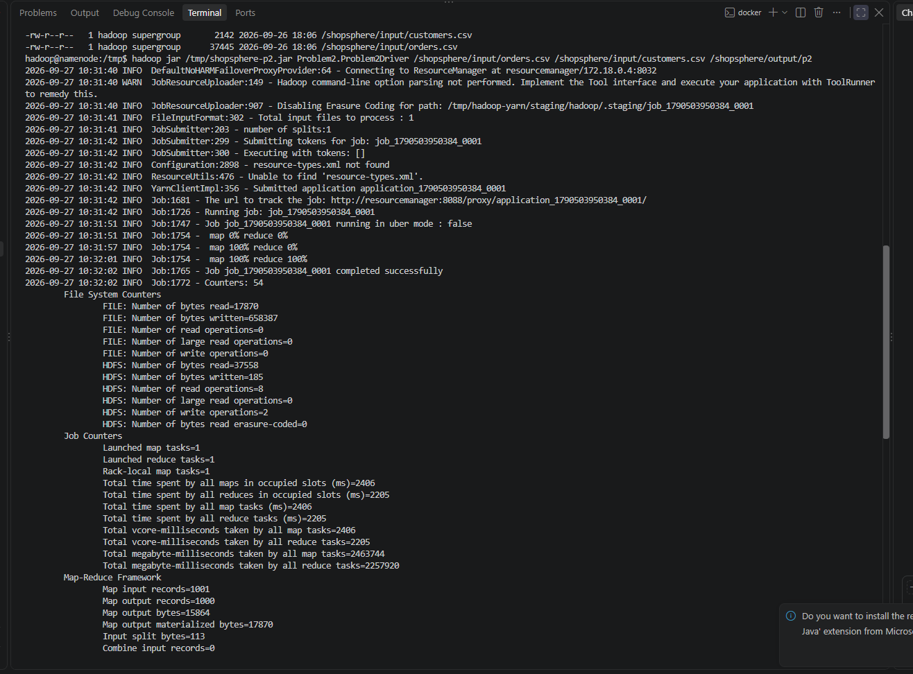
> 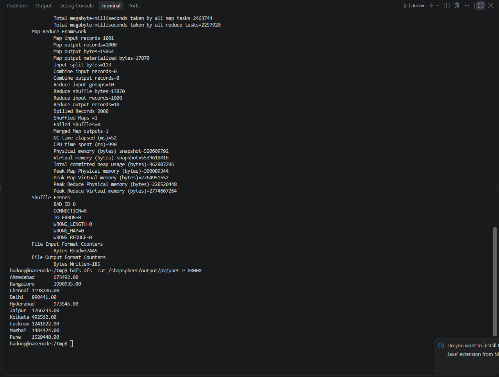

### Screenshot – Problem 2 Output

>
>
> 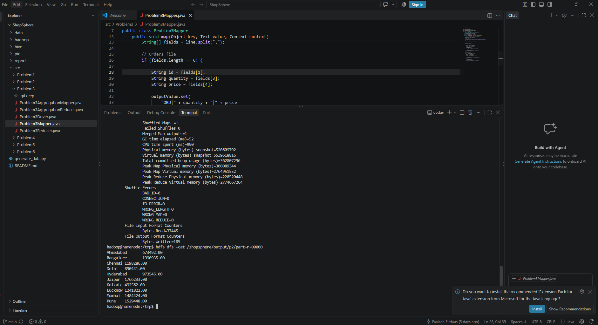

### Screenshot – YARN ResourceManager

>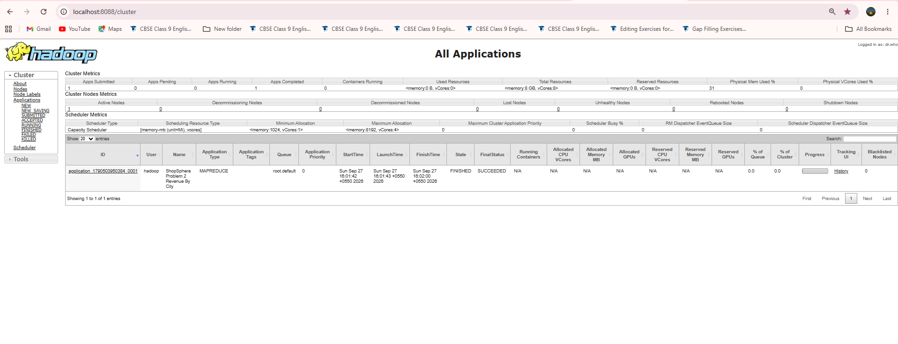
> `http://localhost:8088`

---

# 9. Problem 3 – Average Order Value by Membership Tier

## Objective

Calculate the average order value for each customer membership tier after joining the order data with customer profiles.

## Formula

```text
Order Value = Quantity × Price
```

Then:

```text
Average Order Value
= Sum of Order Values / Number of Orders
```

The two datasets are joined using:

```text
customerId
```

## Join Strategy

A **Reduce-side Join** is used.

The mapper tags records from the two datasets:

```text
ORD  → Order record
CUST → Customer record
```

Both records use `customerId` as the key.

For example:

```text
C001 → ORD|2|1499
C001 → CUST|C001|Gold
```

During the shuffle and sort phase, all records belonging to the same customer are brought together.

The reducer then:

1. Identifies the customer's membership tier.
2. Calculates `quantity × price` for each order.
3. Associates the order value with the membership tier.

## Two-stage MapReduce Processing

### Job 1 – Join

```text
Orders + Customers
        |
        v
Reduce-side Join
        |
        v
Membership Tier + Order Value
```

### Job 2 – Aggregation

```text
Membership Tier + Order Value
        |
        v
Group by Membership Tier
        |
        v
Calculate Average
```

## Implementation

Files:

```text
src/Problem3/
├── Problem3Mapper.java
├── Problem3Reducer.java
├── Problem3AggregationMapper.java
├── Problem3AggregationReducer.java
└── Problem3Driver.java
```

## Execution

The P3 JAR was executed using:

```bash
hadoop jar /tmp/shopsphere-p3.jar \
Problem3.Problem3Driver \
/shopsphere/input/orders.csv \
/shopsphere/input/customers.csv \
/shopsphere/output/p3
```

Both MapReduce jobs completed successfully.

```text
map 100% reduce 100%
Job ... completed successfully
```

### Job 1 Counters

```text
Map input records    = 1102
Map output records   = 1100
Reduce output records = 1000
```

The input consists of:

```text
1000 orders
+ 100 customers
+ 2 header records
= 1102 records
```

The first job generated 1000 joined order-level results.

### Job 2 Counters

The second job processed the 1000 joined order values and produced 3 final records corresponding to:

```text
Gold
Platinum
Silver
```

## Final Output

```text
Gold       12531.081967213115
Platinum   12724.672043010753
Silver     11588.609375
```

### Result Table

| Membership Tier | Average Order Value |
| --------------- | ------------------: |
| Gold            |          ₹12,531.08 |
| Platinum        |          ₹12,724.67 |
| Silver          |          ₹11,588.61 |

The values represent the arithmetic mean of `quantity × price` for orders belonging to customers in each membership tier.

### Screenshot – Problem 3 Execution

> Insert screenshot showing both MapReduce jobs completing successfully.
>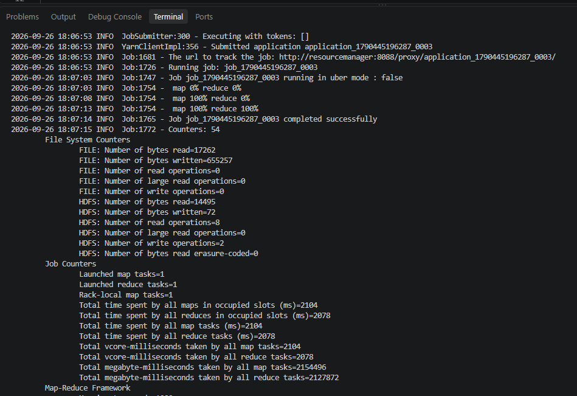

### Screenshot – Problem 3 Output

> Insert screenshot of:
>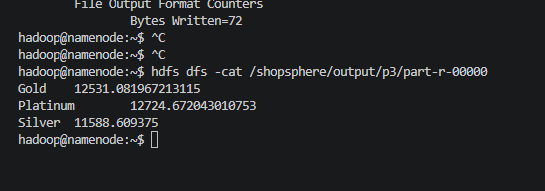
> `hdfs dfs -cat /shopsphere/output/p3/part-r-00000`

### Screenshot – YARN ResourceManager

> Insert screenshot of:
>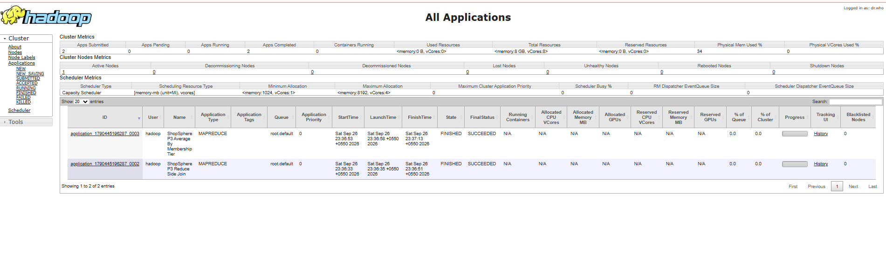
> `http://localhost:8088`

---

# 10. Problem 4 – Top 5 Customers by Total Spend

## Objective

Identify the top five customers based on their total spending.

## Formula

```text
Customer Spend = Σ(Quantity × Price)
```

For every order, the revenue is calculated using:

```text
Quantity × Price
```

The mapper emits customer-wise spending information and the reducer aggregates the total spending for each customer.

The resulting customer totals are then used to identify the top five customers.

## MapReduce Flow

```text
orders.csv
     |
     v
   Mapper
     |
     | customerId → order value
     v
 Shuffle and Sort
     |
     v
  Reducer
     |
     v
Customer total spending
     |
     v
Top 5 customers
```

## Implementation

Files:

```text
src/Problem4/
```


### Screenshot – Problem 4 Output

> Insert HDFS output screenshot.
>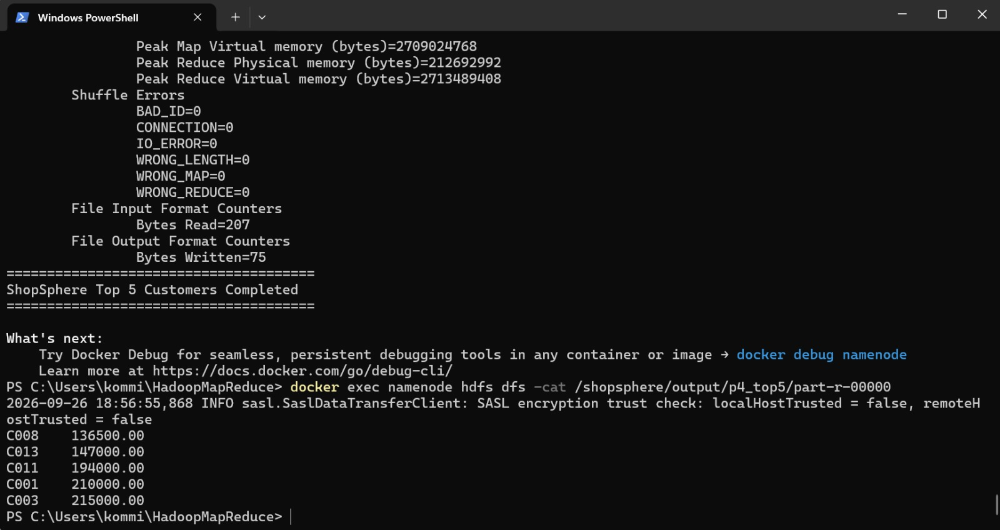
---

# 11. Problem 5 – City-wise Order Percentage and Membership-tier Analysis

## Objective

Analyze the percentage of orders associated with each city and study the distribution of membership tiers.

The analysis uses the customer and order information to associate each order with:

* Customer city
* Membership tier

## Order Percentage

The percentage of orders for a city is calculated as:

```text
City Order Percentage
=
(City Order Count / Total Order Count) × 100
```

## MapReduce Flow

```text
Orders + Customer Information
          |
          v
        Mapper
          |
          v
     Shuffle & Sort
          |
          v
        Reducer
          |
          v
City-wise order percentage
and membership analysis
```

## Implementation

Files:

```text
src/Problem5/
```

## Output
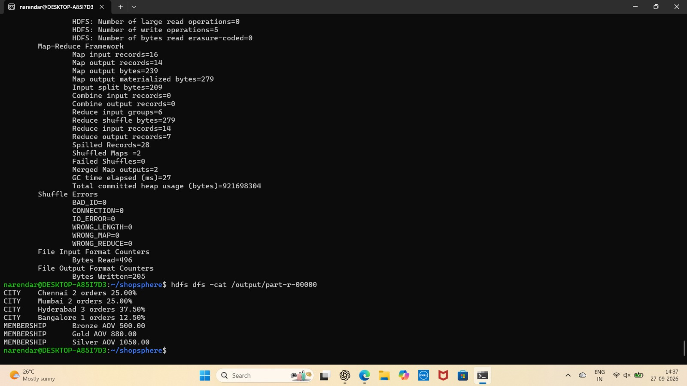


# 12. Hadoop and YARN Execution

All MapReduce jobs are executed inside the Dockerized Hadoop environment.

The general processing architecture is:

```text
                 ShopSphere Dataset
                         |
                         v
                       HDFS
                         |
                         v
                      Mapper
                         |
                         v
                 Shuffle and Sort
                         |
                         v
                      Reducer
                         |
                         v
                   HDFS Output
```

YARN manages the execution of MapReduce applications.

The ResourceManager interface is available at:
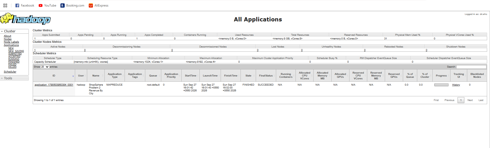
```text
http://localhost:8088
```

### Screenshot – Hadoop ResourceManager

> Insert ResourceManager screenshot showing the submitted/completed application.

---

# 13. Project Structure

```text
ShopSphere/
│
├── data/
│   ├── orders.csv
│   └── customers.csv
│
├── src/
│   ├── Problem1/
│   ├── Problem2/
│   ├── Problem3/
│   ├── Problem4/
│   └── Problem5/
│
├── hive/
│   └── Problem6/
│
├── pig/
│   └── Problem6/
│
├── hadoop/
│   ├── config
│   ├── hdfs-rbf-site.xml
│   └── docker-compose.yml
│
├── report/
│
└── README.md
```

---

# 14. Running the Hadoop Cluster

Start the Hadoop Docker cluster using:

```powershell
docker compose -f hadoop\docker-compose.yml up -d
```

Check the running containers using:

```powershell
docker compose -f hadoop\docker-compose.yml ps
```

The cluster contains:

```text
hadoop-namenode-1
hadoop-datanode-1
hadoop-resourcemanager-1
hadoop-nodemanager-1
```

---

# 15. HDFS Commands

Create the input directory:

```bash
hdfs dfs -mkdir -p /shopsphere/input
```

Upload datasets:

```bash
hdfs dfs -put -f orders.csv /shopsphere/input/orders.csv
hdfs dfs -put -f customers.csv /shopsphere/input/customers.csv
```

Check the files:

```bash
hdfs dfs -ls /shopsphere/input
```

Read MapReduce output:

```bash
hdfs dfs -cat <output-path>/part-r-00000
```

---


# 16. Conclusion

The ShopSphere project demonstrates the use of Hadoop for processing e-commerce order and customer data.

HDFS is used for distributed storage, while MapReduce is used to perform business analytics through mapper and reducer stages. YARN manages the execution of the MapReduce applications within the Dockerized Hadoop cluster.

Problem 1 successfully generated category-wise revenue and order count,
Problem 2 successfully generated city-wise revenue for all 10 cities,
Problem 3 successfully performed a reduce-side join between orders and customer profiles followed by membership-tier aggregation, Problem 4 successfully identified the top 5 customers based on their total spending and
Problem 5 successfully analyzed city-wise order percentage and membership-tier distribution.

The project demonstrates how raw e-commerce data can be transformed into useful analytical results using distributed Big Data processing techniques.

---

